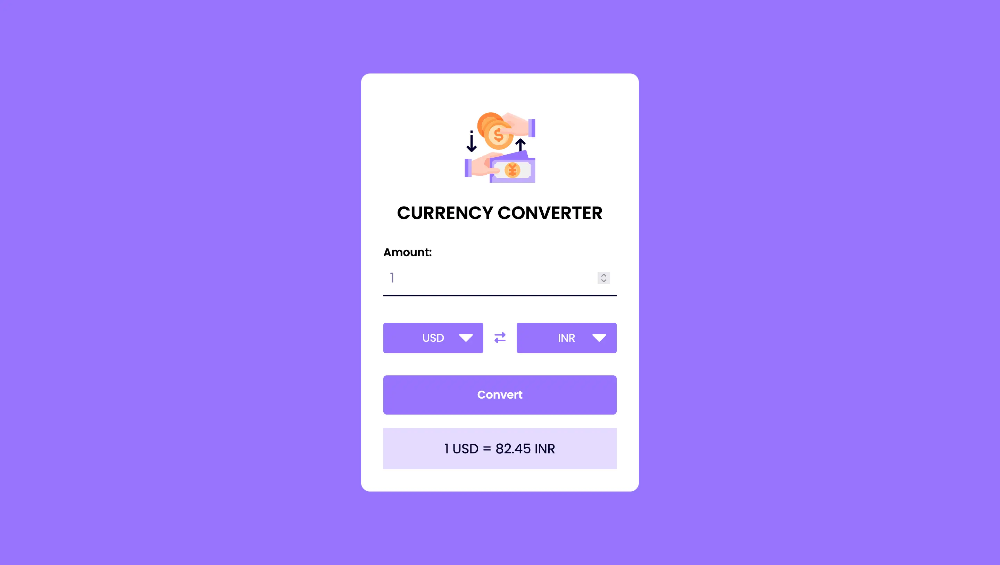

# Currency-Converter

This is a simple currency converter that allows you to convert between different currencies. The app uses the Open Exchange Rates API to get the latest currency exchange rates.

<hr>

💙 Join the channel to see more videos like this. [Code_With_Pankaj](https://www.youtube.com/c/CodeWithPankaj1?sub_confirmation=1)
<hr>

<div align=center>

## Must visit 👇 (Click on it)

[](https://www.youtube.com/c/CodeWithPankaj1?sub_confirmation=1)

</div>

<hr>

## Features

- Convert between 168 different currencies.
- Automatic currency rate updates every hour.
- Simple and easy-to-use interface.
- A responsive design.
- Effect of hovering.
- The width of the device will be automatically fixed.

## API
The app uses the Open Exchange Rates API to get the latest currency exchange rates. You'll need to sign up for a free API key on the <a href="https://openexchangerates.org/signup">Open Exchange Rates</a> website to use the app.

Once you have an API key, you can add it to the api-key.js file:

```
const API_KEY = 'your-api-key-here';
```
The api-key.js file is located in the js directory.

# Usage

To use the currency converter, follow these steps:

1. Enter the amount of currency you want to convert in the "Amount" field.

2. Select the currency you want to convert from in the "From" dropdown.

3. Select the currency you want to convert to in the "To" dropdown.

4. Click the "Convert" button.

5. The converted amount will be displayed in the "Result" field.

## Authors

- [@pankajbaliyan](https://www.github.com/pankajbaliyan)


## Contributing

If you'd like to contribute to the project, please fork the repository and submit a pull request.

## Demo

https://currency-converter-cwp.vercel.app
<br><br>
https://pankajbaliyan.github.io/Currency-Converter/

## Feedback

If you have any feedback, please reach out to us at pankajbaliyan90@gmail.com

## 🔗 Links

[](https://codewithpankaj.vercel.app)

<a href="https://www.youtube.com/c/codewithpankaj1?sub_confirmation=1" target="blank"></a>
<a href="https://linkedin.com/in/pankaj-kumar-90" target="blank"></a><br><br>
<a href="https://leetcode.com/pankajkumar90/" target="blank"></a>
<a href="https://auth.geeksforgeeks.org/user/im_pankaj/practice/" target="blank"></a><br><br>
<a href="https://twitter.com/_pankaj_kumar__" target="blank"></a>
<a href="https://www.hackerrank.com/pankajbaliyan90" target="blank"></a>
<a href="https://discord.gg/qYz4cYc9zP" target="blank"></a>


## Lessons Learned

I learned many things while making this repository, i.e. how to make a webpage responsive to all devices screens and how to make calculation of API response data & more.
## Run Locally

Clone the project

```bash
  git clone https://github.com/PankajBaliyan/Currency-Converter.git
```

Go to the project directory

```bash
  cd Currency-Converter
```

Start code editor

```bash
  code .
```


## Screenshots




## Support

For support, email pankajbaliyan90@gmail.com or join our Slack channel.